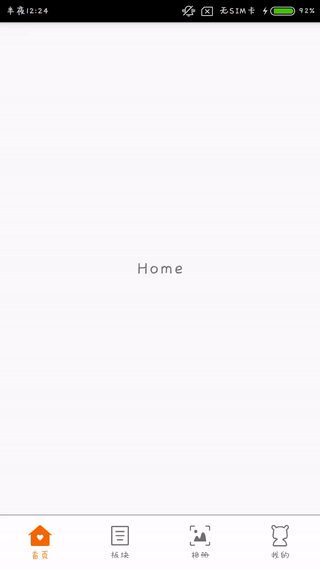

### BottomNaviDemo 

仿小米社区 App 底部导航栏以及TAB切换动画

自定义2个View BottomNaviView 和 BottomNaviBox, 模仿 RadioGroup 和 RadioButton的关系。

BottomNaviView 使用 2 个 ImageView 和 2 个 TextView 显示图片和文字的二态，监听 ViewPager.OnPageChangeListener 的 onPageScrolled 函数改变透明度实现动画效果。

项目主要参考 [https://github.com/leibnik/WechatRadioBar](https://github.com/leibnik/WechatRadioBar)

### Extra

Android Gif 制作可以参考秋百万的 [Make GIF Snapshot for Android APP](http://www.liaohuqiu.net/posts/make-gif-for-android-app/), 录制视频可以使用 Android Studio 中 Android Monitor 左侧的 Screen Record 功能。

### License

Licensed under the Apache License, Version 2.0 (the "License");
you may not use this file except in compliance with the License.
You may obtain a copy of the License at

http://www.apache.org/licenses/LICENSE-2.0

Unless required by applicable law or agreed to in writing, software
distributed under the License is distributed on an "AS IS" BASIS,
WITHOUT WARRANTIES OR CONDITIONS OF ANY KIND, either express or implied.
See the License for the specific language governing permissions and
limitations under the License.